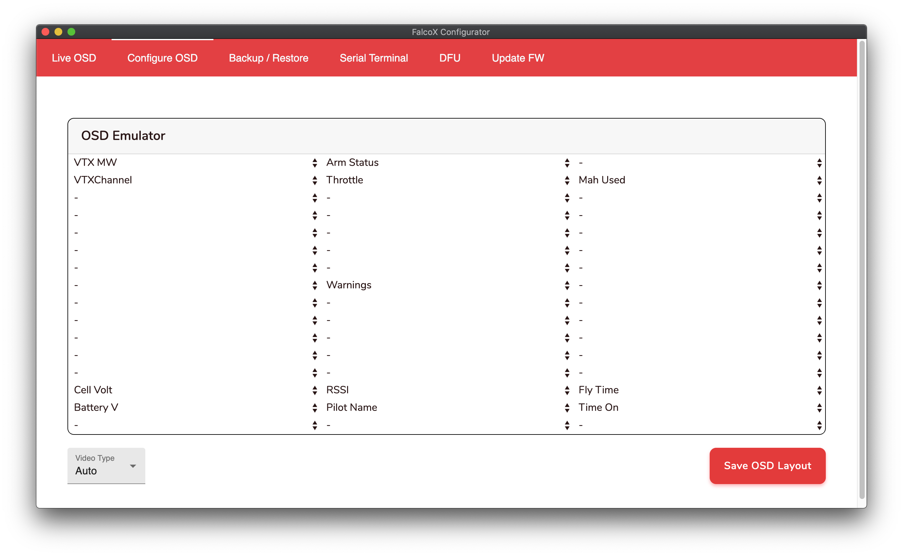

# ACHMIRAL FPV Configuration
This is my Flightone FalcoX backup repo

- [Quad Setup](#quad-setup)
  * [5 inch Freestyle Setup 4s](#5-inch-freestyle-setup-4s)
  * [5 inch Race Setup 4s](#5-inch-race-setup-4s)
  * [New 5 inch Race Setup 4s](#new-5-inch-race-setup-4s)
  * [[WIP] Micro 3 inch Setup](#wip-micro-3-inch-setup)
- [OSD Layout](#osd-layout)
- [Rates](#rates)
  * [Current Stick Rates](#rates)
- [CLI Command](#cli-command)
- [How To Flash .flx File to Revolt OSD FC](#how-to-flash-flx-file-to-revolt-osd-fc)
- [How to Upload Custom OSD Font (Not Tested Yet)](#how-to-upload-custom-osd-font-not-tested-yet)

# Quad Setup

Tuning : Blackbird Low D FS

## 5 inch Freestyle Setup 4s
| Component     | Brand                                     |
| ------------- |-------------------------------------------| 
| Frame         | Rajawali Bouraq 5 Inch                    | 
| FC            | Flightone Revolt OSD Lite                 |
| ESC           | Hobbywing  XRotor Micro 60A 4in1 DShot1200|
| Motor         | T-Motor F60 Pro IV 2550kv                 |
| VTX           | Rush Tank Ultimate Mini 800mW             |
| RX            | TBS Crossfire Nano RX                     |
| FPV Cam       | Caddx Ratel 2.1mm                         |
| VTX Antenna   | Foxeer Lollipop SMA                       |
| Prop          | T-Motor T5143s                            |
| Battery       | Tattu R-Line v3 1550mah 4s                |

## 5 inch Race Setup 4s
| Component     | Brand                                     |
| ------------- |-------------------------------------------| 
| Frame         | Rajawali Bourke 5 Inch                    | 
| FC            | Flightone Revolt OSD Lite                 |
| ESC           | Aikon RD32 45A 4in1 DShot1200             |
| Motor         | DYS 2205 2300kv 4s                        |
| VTX           | Rush Tank Ultimate Plus                   |
| RX            | TBS Crossfire Nano RX                     |
| FPV Cam       | Foxeer Predator Micro V3                  |
| VTX Antenna   | Foxeer Lollipop SMA                       |
| Prop          | HQProp Headsup R38                        |
| Battery       | Tattu R-Line v3 1550mah 4s                |

## New 5 inch Race Setup 4s
| Component     | Brand                                     |
| ------------- |-------------------------------------------| 
| Frame         | SniperX Lite                              | 
| FC            | HGLRC Zeus F722 mini 20x20                |
| ESC           | HGLRC Zeus 45A BL32 4in1 ESC              |
| Motor         | DYS Sunfun 2207 2750kv 4s                 |
| VTX           | Rush Tiny Tank 5.8GHz VTX                 |
| RX            | TBS Crossfire Nano RX                     |
| FPV Cam       | Runcam Racer 2 Nano                       |
| VTX Antenna   | Foxeer 5.8G Micro Lollipop UFL            |
| Prop          | HQProp Headsup R38                        |
| Battery       | Tattu R-Line v3 1550mah 4s                |

## [WIP] Micro 3 inch Setup
| Component     | Brand                                     |
| ------------- |-------------------------------------------| 
| Frame         | HGLRC Sector 150mm 3 inch                 |
| FC            | Flightone Milivolt OSD 20x20              |
| ESC           | Flightone Spark32 50A 4in1 20x20          |
| Motor         | Flashhobby Arthur A1408 1408 2800KV       |
| VTX           | Rush Tank Ultimate Mini                   |
| RX            | TBS Crossfire Nano RX                     |
| FPV Cam       | Foxeer Predator Micro V3                  |
| VTX Antenna   | ?                                         |
| Prop          | ?                                         |
| Battery       | ?                                         |

# OSD Layout

# Rates
## Current Freestyle Stick Rates
Roll
- rate  : 375
- expo  : 38
- acro+ : 165

Pitch
- rate  : 375
- expo  : 38
- acro+ : 165

Yaw
- rate  : 375
- expo  : 38
- acro+ : 165

# CLI Command
- `VERSION` to get the current firmware version 
- `GET <command>` to get the settings value of `<command>`, ex. `GET roll_p`
- `SET <command>` for input settings, , ex. `SET roll_p=50`
- `SAVE` to save settings
- `DUMP` to see all current settings
- `GET_SERIAL` to see the serial number of the FC
- `RESETCONFIG` to reset settings
- `RESET_WIZARD <option>` to reset wizard, `RADIO`, `VTX`, `MOTOR`, `TELEM` `FC`, `VIDEO`, `LEVEL`. ex. `RESET_WIZARD RADIO`.
- `RESET_WIZARD RADIO` to reset radio settings
- `DFU` to enter dfu mode

# How To Flash .flx File to Revolt OSD FC
1. You have to first put the board into DFU (jumping the boot pads for exemple)
2. auto update to latest
3. once done and you're back the firmware page, manually flash the one you want
4. Source [discord link](https://discord.com/channels/422512413552672769/525828485596446736/733407340707184815)

# How to Upload Custom OSD Font (Not Tested Yet)
source: [Wild Willy Comment on FL1 Discord](https://discord.com/channels/422512413552672769/422516423844298762/691052194916728833)
1. Connect to Config
2. Plug in the battery
3. Go into OSD menu in the config
4. Select load Fonts

